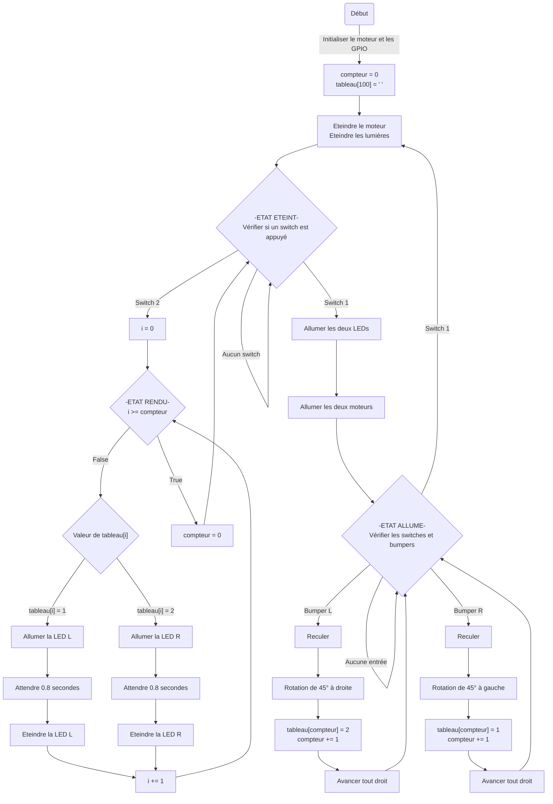

# MazeBot_ESIEE
Projet d'instructions Assembleur (ARM Cortex-M3) pour le robot Stellaris® LM3S9B92 EVALBOT créé lors de ma formation d'Ingénieur à ESIEE Paris

```mermaid
flowchart

    A(Début) -->|Initialiser le moteur et les GPIO| B["compteur = 0\ntableau[100] = ' '"]
    B -->  C[Eteindre le moteur\nEteindre les lumières]

    C --> D{-ETAT ETEINT-\nVérifier si un switch est appuyé}
    
    D--> |Switch 2| T[i = 0]
    T --> F{"-ETAT RENDU-\ni >= compteur"}
        
        F --> |False| V{"Valeur de tableau[i]"}

        F --> |True| AD[compteur = 0]
        AD --> D

            V --> |"tableau[i] = 1"| W[Allumer la LED L]
                W --> X[Attendre 0.8 secondes]
                X --> Y[Eteindre la LED L]
                Y --> Z[i += 1]
                Z --> F
        
            V --> |"tableau[i] = 2"| AA[Allumer la LED R]
            AA --> AB[Attendre 0.8 secondes]
            AB --> AC[Eteindre la LED R]
            AC --> Z
    
    

    D --> |Switch 1| E[Allumer les deux LEDs]
        E --> G[Allumer les deux moteurs]

        G --> I{-ETAT ALLUME-\nVérifier les switches et bumpers}

            I --> |Bumper L| J[Reculer]
                J --> L[Rotation de 45° à droite]
                L --> M["tableau[compteur] = 2\ncompteur += 1"]
                M --> Q[Avancer tout droit]
                Q --> I

            I --> |Bumper R| N[Reculer]
                N --> O[Rotation de 45° à gauche]
                O --> P["tableau[compteur] = 1\ncompteur += 1"]
                P --> R[Avancer tout droit]
                R --> I

            I --> |Switch 1| C
            
            I--> |Aucune entrée| I

    D --> |Aucun switch| D
```
